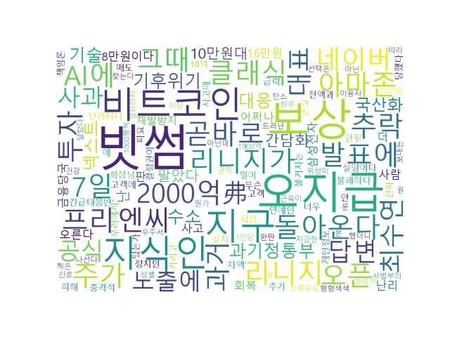

# 네이버 뉴스 헤드라인 수집기 + 워드클라우드 생성기

네이버 뉴스 섹션(정치·경제·사회 등)에서 최신 헤드라인 15개를 자동으로 수집하여  
날짜별 폴더에 CSV 파일로 저장하고, 해당 제목들로 **워드클라우드** 이미지를 생성하는 Python 스크립트입니다.

2시간마다 자동으로 실행되어 헤드라인을 수집하고 CSV 파일과 워드클라우드를 저장하도록 설계했습니다. Ctrl+C로 종료 가능합니다.


## 주요 기능

- 네이버 뉴스 6개 섹션(정치, 경제, 사회, 생활/문화, 세계, IT/과학) 중 선택 가능
- 헤드라인 15개 수집 (중복 제거)
- 날짜별 폴더 자동 생성 (예: `2026-02-08`)
- 시간별 CSV 파일 저장 (예: `news_1830.csv`)
- 제목 텍스트로 워드클라우드 PNG 생성 (예: `wordcloud1830.png`)
- 2시간(7200초) 간격 자동 반복 실행
- Ctrl+C로 안전 종료

### 예시 워드클라우드



(위 이미지는 정치 섹션 헤드라인으로 생성된 예시입니다. 실제 결과는 시점에 따라 다릅니다.)

## 실행 시 유의사항

1~6 중 숫자를 입력하여 뉴스 섹션 선택
프로그램이 자동으로 2시간마다 뉴스 수집 & 저장 & 워드클라우드 생성
저장 위치: 실행 폴더 내 날짜 폴더 (예: ./2026-02-08/news_1420.csv)

malgun.ttf 폰트가 Windows에 설치되어 있어야 워드클라우드 한글이 정상 출력됩니다.
네이버의 봇 차단 정책으로 인해 장기 실행 시  차단될 수 있으니, 적당한 간격 유지 & User-Agent 업데이트 추천


## 사용 방법

1. **필요 패키지 설치**

```bash
pip install requests beautifulsoup4 wordcloud matplotlib


2. 실행 방법
python naver_news_scraper.py

